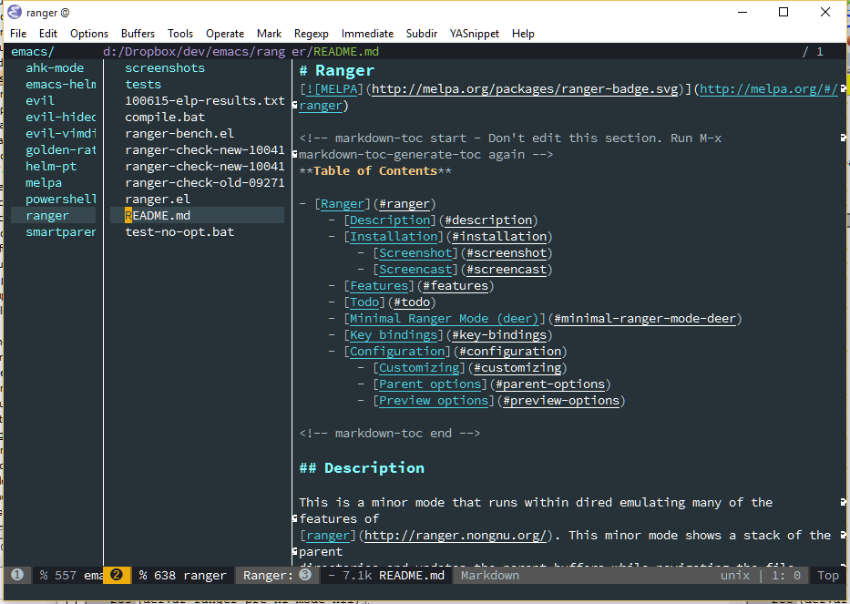

# Ranger

[](https://gitter.im/ralesi/ranger.el?utm_source=badge&utm_medium=badge&utm_campaign=pr-badge&utm_content=badge)
[](http://melpa.org/#/ranger)

<!-- markdown-toc start - Don't edit this section. Run M-x markdown-toc-generate-toc again -->
**Table of Contents**

- [Ranger](#ranger)
    - [Description](#description)
    - [Installation](#installation)
        - [Screenshot](#screenshot)
        - [Screencast](#screencast)
    - [Features](#features)
    - [Todo](#todo)
    - [Window conventions for Ranger](#window-conventions-for-ranger)
        - [Standard Ranger Bindings](#standard-ranger-bindings)
    - [Coming from dired](#coming-from-dired)
    - [Minimal Ranger Mode (deer)](#minimal-ranger-mode-deer)
    - [Setting as Default Directory Handler](#setting-as-default-directory-handler)
    - [Bookmark Navigation](#bookmark-navigation)
    - [Tab and History Usage](#tab-and-history-usage)
    - [Copy and Paste Functionality](#copy-and-paste-functionality)
    - [Selected File Actions](#selected-file-actions)
    - [File Sorting and Listing](#file-sorting-and-listing)
    - [Configuration](#configuration)
        - [Buffer Management](#buffer-management)
        - [Directory Listing](#directory-listing)
        - [Window Decoration and Appearance](#window-decoration-and-appearance)
            - [Delays](#delays)
        - [Parent Window Options](#parent-window-options)
        - [Preview Window Options](#preview-window-options)

<!-- markdown-toc end -->

## Description

This is a minor mode that runs within dired emulating many of the features of
[ranger](http://ranger.nongnu.org/). This minor mode shows a stack of the parent
directories and updates the parent buffers while navigating the file system. The
preview window takes some of the ideas from [Peep-Dired](https://github.com/asok/peep-dired)
to display previews for selected files in the primary dired buffer.

## Installation

Once you have setup [Melpa](https://melpa.org/#/getting-started) you can
use `package-install` command to install Ranger. The package name is `ranger`.

### Screenshot

ranger mode active


ranger mode showing image


### Screencast

ranger screencast


## Features

* Preview of selected file / directory
* Multi-column display of parent directories
* History log and prompt to navigate through history
* Toggle between literal file viewing and actual
* Indirectly scroll through previewed files
* Show images inline in preview window
* Fit images to window when previewing (requires image-dired)
* Quick and persistent sorting across folders
* Quick access to shell
* Mouse support
* Emacs bookmarks support
* Create bindings to go up / down the next directory
* Minimal ranger mode (deer-mode)
* Copy / paste functionality
* Persistent flags showing recently copied items

## Todo

* Preview PDF and document viewing
* Improved navigation within archive files
* Set up tabs and navigation between
* Work with flattened subdirs and tree

## Window conventions for Ranger

ranger mode with preview enabled


Ranger has the ability to show the parent directories for the current working
directory and also a preview for the currently selected file.

In this package, the parent windows denote any window to the left of the active
ranger window. These represent the immediate parent directory of the current
directory and any parents of that if `ranger-parent-depth` is greater than 1. If
navigating the root directory, the parent window will disappear. The parent
window is not expected to be interacted with; however, `[` and `]` will navigate
up and down the parent directories, also `<Mouse-1>` can be used to quickly
navigate to a file / folder in the parent window.

The active window is designated as the ranger or primary window.  Most file
activities are performed here.  `h` and `l` will navigate up to the parent
directory and open the selected file or directory. Opening a file in ranger is
designed to close the ranger interface and revert the window configuration to
its previous state.

The window on the right side is designated as the preview window. The visibility
of the preview window can be toggled with the `ranger-preview-file` setting and
the keybinding `i`. Files will be previewed in the preview window when
selected. A raw preview of the file is set by default with the
`ranger-show-literal` setting, but can be toggled by `zi`, at which case a fully
formatted preview of the file will be shown. Additionally, when
`ranger-show-literal` is disabled, images and archive contents will be shown in
the preview window when selected. When a directory is selected in the ranger
window, a file listing of the subdirectory will be shown.

### Standard Ranger Bindings

 Keybinding    | Description
 ------------- | -----------
 `?`           | show ranger help
 `j`           | navigate down
 `k`           | navigate up
 `h`           | go up directory
 `l`           | find file / enter directory
 `f`           | search for file names
 `i`           | show preview of current file
 `RET`         | find file / enter directory
 `C-r`         | refresh
 `^R`          | revert buffer
 `q`           | quit
 `gg`          | goto first file
 `G`           | goto last file
 `gh`          | goto home directory
 `C-SPC`/`TAB` | mark current file
 `v`           | toggle all marks
 `V`           | visually select lines
 `u`           | unmark the selected file
 `D`           | delete the selected file
 `R`           | rename/move the selected file
 `o`           | show sort dialog
 `zi`          | toggle showing literal / full-text previews
 `zh`          | toggle showing dotfiles
 `zf`          | toggle showing image full-size or fitted to window
 `z-`          | reduce number of parents
 `z+`          | increment number of parents
 `zp`          | toggle between full ranger and deer-mode
 `S`           | eshell popup window
 `!`           | run shell command
 `[`           | previous parent directory
 `]`           | next parent directory
 `J`           | next subdir
 `K`           | previous subdir
 `C-j`         | scroll preview window down
 `C-k`         | scroll preview window up

## Coming from dired

Ranger works as a replacement to `dired`, but there are a couple of things you have to know:
* If you don't like seen windows with the parent folders, you can user the minimal `ranger` mode called `deer` (see next section).
* When you open a file, the `ranger` session gets finalized. If you want to restore it after closing the file, just try opening `ranger` again (it will remember exactly the path where you were before).
* If you want to execute a shell command just for the marked files, instead of all the files in the current directory, you have to use `dired-do-shell-command` (in `spacemacs` it is bound to `;!`).

## Minimal Ranger Mode (deer)

Termed as `deer-mode`, based on the zsh module developed by Vifon, we can use
ranger in a single window without preview or parent directories.  This allows
all the functionality built-in to ranger without modifying any other buffer
windows.  Toggle between `ranger` and `deer` with `zp`.

deer mode (minimal ranger mode)


## Setting as Default Directory Handler

Ranger has the ability to be used as the default directory handler when Emacs
identifies a directory is opened.  To make `deer` the default handler, set
`ranger-override-dired` and restart.

```el
(setq ranger-override-dired t)
```

## Bookmark Navigation

Ranger makes use of the built-in bookmark functionality in Emacs by creating
bookmarks with the name `ranger-?` where ? can be any single key.  This allows
fast navigation to predefined directories that are persistent across sessions.
A new mark can be set with `m` and can be accessed with the tilde key.  A prompt
of all directory bookmarks can be accessed with `B`. 

 Keybinding    | Description
 ------------- | -----------
 ```           | goto bookmark
 `m`           | set bookmark
 `B`           | show bookmark prompt


## Tab and History Usage

Ranger offers tabs to allow quick navigation between temporary working
directories.  These do not persist across sessions, but are useful when
navigating the file system to multiple paths.  In addition to tabs, the file
navigation history of the current ranger session is saved to allow traversal to
recently accessed directories.  By default, ranger shows the number and the file
name of the buffer as a tab.  This can be adjusted by modifying the
`ranger-tabs-style` variable.

 Keybinding    | Description
 ------------- | -----------
 `gn`          | create a new tab
 `gT`          | go to previous tab
 `gt`          | go to next tab
 `gc`          | close current tab
 `zz`          | search through history
 `H`           | history back
 `L`           | history next

## Copy and Paste Functionality

Ranger utilizes a copy ring to save a persistent fileset that can then be
either moved or copied to a target directory.  This is consistent with the
way the ranger file manager manages file movement. `yy` specifies to copy the
marked or currently hovered files.  Additionally a flag denoted as "P" will
visually indicate what files are marked for movement. `dd` likewise specifies
that the files will be moved instead of copied.

Using the universal prefix `<C-u>` prior to this binding will update the selected files
to the current copy register.  To check the files in the current copy ring,
press `p?`.

To paste the files most recently added to the copy ring, use `pp` or `po` to
paste.  The latter binding will overwrite existing files.

 Keybinding    | Description
 ------------- | -----------
 `yy`          | mark files to copy
 `dd`          | mark files to move
 `pp`          | paste files in copy ring
 `po`          | paste files in copy ring and overwrite existing
 `p?`          | show the copy contents

## Selected File Actions

There are additional features to allow one to open a file or directory while
maintaining the previously selected window before ranger is initiated. These
keys will open the current file or all the marked files as described below. In
the case of running this in deer, the deer window will not close and a new split
/ frame will be added as described. This allows the creation of an additional
deer window if the currently selected file is also a directory for dual pane usage.

 Keybinding    | Description
 ------------- | -----------
 `ws`          | exit ranger and open selected file in vertical split
 `wv`          | exit ranger and open selected file in horizontal split
 `wf`          | exit ranger and open selected file in new frame
 `we`          | open the selected file in external app

## File Sorting and Listing

Ranger uses dired's default sorting mechanism, but also adds some additional
functionality.  The default listing switches supplied to dired can be adjusted
using the `ranger-listing-switches` parameter.  Once set, all ranger windows
will show these parameters.

Additionally, the dired buffer is modified to sort directories to the top.  If
this is not the desired functionality, the user can change
`ranger-listing-dir-first`.  

The `o` key provides sorting options for the current buffer.  In cases when the
variable `ranger-persistent-sort` is set, this sorting method is used for all
other ranger buffers.

## Configuration

Most parameters can be toggled on and off and stay within the current emacs
session. Any settings that are desired on startup should be set below.

### Buffer Management

When disabling the mode you can choose to kill the buffers that were opened while browsing the directories.
```el
(setq ranger-cleanup-on-disable t)
```

Or you can choose to kill the buffer just after you move to another entry in the dired buffer.
```el
(setq ranger-cleanup-eagerly t)
```

### Directory Listing

You can choose to show dotfiles at ranger startup, toggled by `zh`.
```el
(setq ranger-show-dotfiles t)
```

### Window Decoration and Appearance

Ranger by default modifies the header-line in dired to make a more consistent
appearance to the real ranger. Setting to nil will disable this feature.
```el
(setq ranger-modify-header t)
```

Define custom function used to output header of primary ranger window. Must
return a string that is placed in the header-line.
```el
(setq ranger-header-func 'ranger-header-line)
```

Define custom function used to output header of parent and preview windows. Must
return a string that is placed in the header-line.
```el
(setq ranger-parent-header-func 'ranger-parent-header-line)
(setq ranger-preview-header-func 'ranger-preview-header-line)
```

The cursor can also be hidden for a seamless user experience showing just the
cursor line. This feature can be disabled in the cases for themes that do not have a visible cursor line
```el
(setq ranger-hide-cursor nil)
```

#### Delays

Certain window display options are defined with a delay for a better user
experience.  The below options can be customized to adjust time to display the
preview and the footer information.
```el
(setq ranger-footer-delay 0.2)
(setq ranger-preview-delay 0.040)
```

### Parent Window Options

You can set the number of folders to nest to the left, adjusted by `z-` and `z+`.
```el
(setq ranger-parent-depth 2)
```

You can set the size of the parent windows as a fraction of the frame size.
```el
(setq ranger-width-parents 0.12)
```

When increasing number of nested parent folders, set max width as fraction of
frame size to prevent filling up entire frame with parents.
```el
(setq ranger-max-parent-width 0.12)
```

### Preview Window Options

Set the default preference to preview selected file. 
```el
(setq ranger-preview-file t
```

You can choose to show previews literally, or through find-file, toggled by `zi`.
```el
(setq ranger-show-literal t)
```

You can set the size of the preview windows as a fraction of the frame size.
```el
(setq ranger-width-preview 0.55)
```

You probably don't want to open certain files like videos when previewing. To ignore certain files when moving over them you can customize the following to your liking:

```el
(setq ranger-excluded-extensions '("mkv" "iso" "mp4"))
```

To set the max files size (in MB), set the following parameter:

```el
(setq ranger-max-preview-size 10)
```

The preview function is also able to determine if the file selected is a binary
file.  If set to t, these files will not be previewed. 

```el
(setq ranger-dont-show-binary t) 
```
