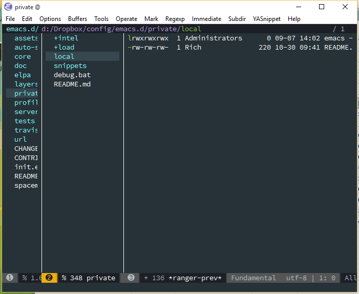
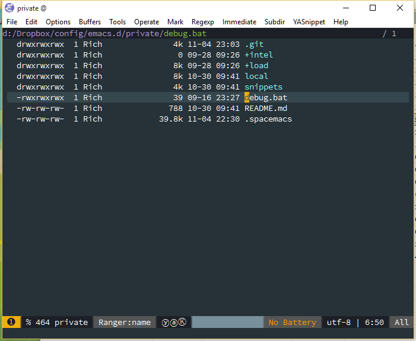

# Ranger

[](https://gitter.im/ralesi/ranger.el?utm_source=badge&utm_medium=badge&utm_campaign=pr-badge&utm_content=badge)
[](http://melpa.org/#/ranger)

*Build Status*
- **master** : [](https://travis-ci.org/ralesi/ranger.el)
- **develop** : [](https://travis-ci.org/ralesi/ranger.el)

<!-- markdown-toc start - Don't edit this section. Run M-x markdown-toc-generate-toc again -->
**Table of Contents**

- [Ranger](#ranger)
    - [Description](#description)
    - [Installation](#installation)
        - [Screenshot](#screenshot)
        - [Screencast](#screencast)
    - [Features](#features)
    - [Todo](#todo)
    - [Window conventions for Ranger](#window-conventions-for-ranger)
    - [Ranger Key Bindings](#ranger-key-bindings)
        - [Basic Commands](#basic-commands)
        - [Navigation](#navigation)
        - [Search for a File / Directory](#search-for-a-file--directory)
        - [Copy, Rename/Move or Delete](#copy-renamemove-or-delete)
        - [Subdirectories](#subdirectories)
        - [Marking](#marking)
        - [Sorting](#sorting)
        - [Toggles / Settings](#toggles--settings)
        - [Shell](#shell)
        - [Writable Dired Mode](#writable-dired-mode)
        - [Other](#other)
        - [Mouse](#mouse)
    - [Coming from dired](#coming-from-dired)
    - [Minimal Ranger Mode (deer)](#minimal-ranger-mode-deer)
    - [Setting as Default Directory Handler](#setting-as-default-directory-handler)
    - [Bookmark Navigation](#bookmark-navigation)
    - [Tab and History Usage](#tab-and-history-usage)
    - [Copy and Paste Functionality](#copy-and-paste-functionality)
    - [Selected File Actions](#selected-file-actions)
    - [File Sorting and Listing](#file-sorting-and-listing)
    - [Troubleshooting and Package Workarounds](#troubleshooting-and-package-workarounds)
        - [helm-descbinds](#helm-descbinds)
    - [Configuration](#configuration)
        - [Buffer Management](#buffer-management)
        - [Directory Listing](#directory-listing)
        - [Window Decoration and Appearance](#window-decoration-and-appearance)
            - [Header-lines](#header-lines)
            - [Delays](#delays)
        - [Parent Window Options](#parent-window-options)
        - [Preview Window Options](#preview-window-options)
            - [Exclude Files From Being Previewed](#exclude-files-from-being-previewed)
                - [By Extension](#by-extension)
                - [By Size](#by-size)
                - [Binary Files](#binary-files)

<!-- markdown-toc end -->


## Description

This is a minor mode that runs within dired, it emulates many of
[ranger's](http://ranger.nongnu.org/) features. This minor mode shows a stack of
parent directories, and updates the parent buffers, while you're navigating the
file system. The preview window takes some of the ideas from
[Peep-Dired](https://github.com/asok/peep-dired), to display previews for the
selected files, in the primary dired buffer.

## Installation

Once you have setup [Melpa](https://melpa.org/#/getting-started) you can use the
`package-install` command, to install Ranger. The package name is `ranger`.

### Screenshot

Ranger mode active



Ranger mode showing an image


### Screencast

Ranger screencast


## Features

* Preview the selected file / directory
* Multi-column display of parent directories
* History log and prompt to navigate through history
* Toggle the file preview, between literal (raw) or fully formatted
* Indirectly scroll through previewed files
* Show images in the preview window
* Fit images to the window when previewing (requires image-dired)
* Quick and persistent sorting across folders
* Quick access to the shell
* Mouse support
* Emacs bookmarks support
* Create bindings to go up / down the next directory
* Minimal ranger mode (deer-mode)
* Copy / paste functionality
* Persistent flags showing recently copied items

## Todo

* Preview PDF and document viewing
* Improved navigation within archive files
* Set up tabs and navigate between them
* Work with flattened subdirs and tree

## Window conventions for Ranger

Ranger mode with preview enabled


Ranger has the ability to show parent directories, for the current working
directory, and a preview of the currently selected file or folder.

In this package, the parent windows denote any window to the left of the active
ranger window. These represent the selected file or folder's immediate parent
directory. And to the left of the parent window, any number of grandparent
windows, if the `ranger-parent-depth` variable is greater than 1. If you
navigate to the root directory, then the parent window will disappear. The
parent window is not expected to be interacted with, however `[` and `]` will
navigate up and down the parent directories. `<Mouse-1>` can also be used to
quickly navigate to a file / folder in the parent window.

The active window is designated as the ranger or primary window. Most file
activities are performed here. `h` navigates up to the parent directory, and `l`
opens the selected file or directory. When a file is opened in ranger, then the
ranger interface closes, and the window configuration reverts to its previous
state.

The window on the right side is designated as the preview window. It shows the
contents of the selected file or directory. The preview window is open by
default, but it can be opened or closed by pressing: `i`. It's default state is
set with the `ranger-preview-file` variable. Selected files are previewed
literally (raw) without any formatting, by default. To toggle between a fully
formatted or a literal preview, press: `zi`. To preview images, and the contents
of archive files, then the literal preview needs to be disabled. The default
literal state, is set with the `ranger-show-literal` variable.

## Ranger Key Bindings

### Basic Commands

 Key Binding   | Description
 ------------- | -----------
 `?`           | show basic commands in the minibuffer
 `du`          | show selected files, file size
 `q` / `ZZ`    | close tab or disable (quit) ranger
 `Q` / `ZQ`    | disable (quit) ranger
 `C-r`         | refresh ranger buffer

### Navigation

 Key Binding       | Description
 ----------------- | -----------
 `k`/`up`          | up
 `j`/`down`        | down
 `h`/`-`/`left`    | to parent directory
 `l`/`RET`/`right` | to selected directory / open file
 `gg`              | to top
 `G`               | to bottom
 `<`               | to previous directory
 `>`               | to next directory
 `gh`              | to home directory
 `C-b`             | scroll ranger window full page up
 `C-f`             | scroll ranger window full page down
 `K`/`C-u`         | scroll ranger window half page up
 `J`/`C-d`         | scroll ranger window half page down
 `C-k`             | scroll preview window up
 `C-j`             | scroll preview window down
 `[`               | previous parent directory
 `]`               | next parent directory
 `;M-{`            | previous marked file / directory
 `;M-}`            | next marked file / directory

### Search for a File / Directory

 Key Binding   | Description
 ------------- | -----------
 `f`           | search for file / directory

### Copy, Rename/Move or Delete

When the copy command is called by pressing `;C`, and only a single file or
directory is selected. Then a you'll be asked to enter a new name. However when
it's called with multiple marked files / directories, then a you'll be asked for
the path to the target directory.

 Key Binding   | Description
 ------------- | -----------
 `;C`          | copy the current/marked file(s) / dir(s)
 `R`           | rename/move the current/marked file(s) / dir(s)
 `D`           | delete the current/marked file(s) / dir(s)
 `;d`          | flag current file/dir for deletion, and select next
 `;x`          | delete flagged file(s) / dir(s)

### Subdirectories

 Key Binding    | Description
 -------------- | -----------
 `I`            | insert subdirectory from selected folder
 `gk`           | move to prev subdirectory
 `gj`           | move to next subdirectory

### Marking

 Key Binding        | Description
 ------------------ | -----------
 `t`                | toggle mark on current file / directory
 `;m`/`C-SPC`/`TAB` | mark current file / dir, and select next
 `;u`               | unmark current file / dir, and select next
 `;U`               | unmark all files
 `v`                | invert all marks
 `"`                | mark files (regexp)

### Sorting

 Key Binding   | Description
 ------------- | -----------
 `on`          | name
 `oN`          | name (reverse)
 `oe`          | extension
 `oE`          | extension (reverse)
 `os`          | size
 `oS`          | size (reverse)
 `ot`          | modified date/time
 `oT`          | modified date/time (reverse)
 `oc`          | created date/time
 `oC`          | created date/time (reverse)
 `zd`          | sort directories first or last

### Toggles / Settings

 Key Binding   | Description
 ------------- | -----------
 `i`           | toggle the preview window
 `zh`          | toggle hidden files (e.g. dotfiles)
 `zi`          | toggle literal / full-text previews
 `zf`          | toggle image full-size / fit to window
 `zP`          | toggle between full ranger / deer-mode
 `zp`          | toggle file details in deer-mode
 `z-`          | reduce number of parent windows
 `z+`          | increase number of parent windows

### Shell

 Key Binding   | Description
 ------------- | -----------
 `!`           | run shell command on file
 `;&`          | run async shell command on file
 `S`           | eshell popup window

### Writable Dired Mode

WDired mode changes the file listings buffer to editable text. This makes it
easier to rename multiple files. Depending on the width of the Emacs frame. It
might be useful to toggle off the preview window, by pressing: `i`. Before
starting WDired mode. This leaves more room for editing the file names.

 Key Binding         | Description
 ------------------- | -----------
 `C-c C-e`           | start WDired mode
 `C-c C-c`/`C-x C-s` | finish, rename changed file names, exit WDired mode
 `C-c C-k`/`C-c ESC` | abort, reverting any changes
 `C-x C-q`           | exit, ask to save/revert modified file names

### Other

 Key Binding   | Description
 ------------- | -----------
 `;+`/`+`      | create directory
 `;=`/`=`      | diff: current file and asks for 2nd file
 `;g`          | revert current buffer, with file on disk
 `;k`          | kill (hide) marked lines, `C-r` to unhide

### Mouse

 Key Binding   | Description
 ------------- | -----------
 `mouse-1`     | move to selected directory, or open file and quit ranger
 `mouse-3`     | move to parent directory

## Coming from dired

Ranger works as a replacement to `dired`, but there are a couple of things you
need to know:
* If you don't like seeing the windows with the parent folders. Then you can use
  the minimal `ranger` mode, it's called `deer` (see the next section).
* When you open a file, then the `ranger` session gets finalized. If you want to
  restore it after closing the file, just open `ranger` again (it will remember
  the exact path, where you were before).

## Minimal Ranger Mode (deer)

Ranger can be used in a single window, without the preview or parent windows.
This is called `deer-mode`, and it's based on the zsh module that's developed by
Vifon. This allows for using all the functionality that's built-in to ranger,
without having to modify any other buffer windows. To toggle between `ranger`
and `deer`, press: `zP`.

Deer mode (minimal ranger mode)


## Setting as Default Directory Handler

Ranger can be used as the default directory handler when Emacs identifies that a
directory has been opened. To make `deer` the default handler, set the override
minor mode `ranger-override-dired-mode` to `t`. Setting it to nil, disables this
feature, and opens the standard `dired` buffer.

```el
(ranger-override-dired-mode t)
```

## Bookmark Navigation

Ranger makes use of the built-in bookmarks functionality in Emacs. By creating
bookmarks with the name `ranger-?`, where `?` can be any single key. This allows
for fast navigation, to predefined directories, that are persistent across
sessions. A new mark can be set with `m`, and can be accessed with the tilde key
(below Esc) or with the single quote key. A prompt of all directory bookmarks
can be accessed by pressing: `B`.

 Key Binding   | Description
 ------------- | -----------
 `` ` ``/`'`   | go to bookmark
 `m`           | set bookmark
 `um`          | delete bookmark
 `B`           | show the bookmarks prompt


## Tab and History Usage

Ranger offers tabs to allow for quick navigation between temporary working
directories. These do not persist across sessions, but are useful when
navigating to multiple paths in the file system. In addition to tabs, the file
navigation history, of the current ranger session, is also saved. This allows
for traversal to recently accessed directories. By default, ranger shows the
file name of the buffer as a tab. This can be adjusted by modifying the
`ranger-tabs-style` variable.

 Key Binding   | Description
 ------------- | -----------
 `gn`          | create a new tab
 `gT`          | go to previous tab
 `gt`          | go to next tab
 `gc`          | close current tab
 `uq`          | restore the last closed tab
 `zz`          | search through history
 `H`           | history back
 `L`           | history next

## Copy and Paste Functionality

Ranger utilizes a copy ring, to save a persistent fileset, that can be moved or
copied to a target directory. This is consistent with the way the ranger file
manager manages file movement. `yy` specifies to copy the marked or currently
hovered files. Additionally a flag denoted as "P" will visually indicate what
files are marked for copying. `dd` likewise specifies that the files will be
moved instead of copied. Files marked for movement, are flagged with "M".

Using the universal prefix `<C-u>` prior to this binding will update the
selected files to the current copy register. To check the files in the current
copy ring, press `p?`.

To paste the files / directories most recently added to the copy ring, use `pp`,
or to overwrite existing files, use `po`.

 Key Binding   | Description
 ------------- | -----------
 `yy`          | mark files to copy
 `dd`          | mark files to move
 `pp`          | paste files in copy ring
 `po`          | paste files in copy ring and overwrite existing
 `p?`          | show the copy contents

## Selected File Actions

There are additional features that allow for opening a file or directory, while
maintaining the previously selected window, before ranger is initiated. These
keys will open the current file or all the marked files as described below. In
the case of running this in deer, the deer window will not close and a new split
/ frame will be added as described. This allows the creation of an additional
deer window, if the currently selected file, also is a directory for dual pane
usage.

 Key Binding   | Description
 ------------- | -----------
 `ws`          | exit ranger and open selected file in horizontal split
 `wv`          | exit ranger and open selected file in vertical split
 `wf`          | exit ranger and open selected file in new frame
 `we`          | open the selected file in external app

## File Sorting and Listing

Ranger uses dired's default sorting mechanism, but it also adds some additional
functionality. The default listing switches that are supplied to dired can be
adjusted using the `ranger-listing-switches` parameter. Once they are set, then
all ranger windows will show these parameters.

Additionally, the dired buffer is modified to sort directories to the top. If
this is not the desired functionality, then the user can change
`ranger-listing-dir-first`.

The `o` key provides sorting options for the current buffer. In cases when the
variable `ranger-persistent-sort` is set, then this sorting method is used for
all other ranger buffers.

## Troubleshooting and Package Workarounds

Ranger.el needs to control all window placements, when it's open. This ensures
that the parent / primary / preview windows are placed properly, and updated
upon file movement. As such, there are some known issues with certain packages
when they attempt to control the window placements while `ranger` is
initialized.

### helm-descbinds

This package defaults to opening a helm window with all available bindings in
one-window. This causes conflicts with ranger, but there is a workaround.

```el
(setq helm-descbinds-window-style 'same-window)
```

## Configuration

Most parameters can be toggled on and off, and stay within the current Emacs
session. Any settings that are desired on startup should be set below.

### Buffer Management

When disabling/closing the ranger session, then you can choose to kill the
buffers that were opened while browsing the directories.
```el
(setq ranger-cleanup-on-disable t)
```

Or you can choose to kill the buffers, after you move to another entry in the
dired buffer.
```el
(setq ranger-cleanup-eagerly t)
```

### Directory Listing

Hidden files (e.g. dotfiles) can be shown or hidden by pressing `zh`. To show
them when ranger starts, set the following variable to `t`.
```el
(setq ranger-show-hidden t)
```

### Window Decoration and Appearance

#### Header-lines

The header-line in dired is modified, to make it's appearance more consistent
with the real ranger. To disable this feature, set the following variable to
`nil`.
```el
(setq ranger-modify-header t)
```

The primary ranger windows header-line, can be customized, by calling a function
that outputs a string.
```el
(setq ranger-header-func 'ranger-header-line)
```
The same thing can be done to the parent and preview windows header-lines.
```el
(setq ranger-parent-header-func 'ranger-parent-header-line)
(setq ranger-preview-header-func 'ranger-preview-header-line)
```

The cursor can be hidden, for a more seamless user experience. Only the cursor
line will be shown. This feature can be disabled, for themes that don't have a
visible cursor line.
```el
(setq ranger-hide-cursor nil)
```

#### Delays

Certain window display options are defined with a delay, for a better user
experience. The options below can be customized, to adjust the time it takes to
display the preview and the footer information.
```el
(setq ranger-footer-delay 0.2)
(setq ranger-preview-delay 0.040)
```

### Parent Window Options

The number of (grand/grand/.../)parent windows, that are displayed to the left
of the primary ranger window, can be adjusted by pressing: `z-` or `z+`. They
can also be changed by setting with the variable below.
```el
(setq ranger-parent-depth 2)
```

You can set the size of the parent windows as a fraction of the frame size.
```el
(setq ranger-width-parents 0.12)
```

When the number of parent windows are increased, then their max width can be
set, as a fraction of the frame size. This prevents them from filling up the
entire frame with parent windows.
```el
(setq ranger-max-parent-width 0.12)
```

### Preview Window Options

Ranger can be set to preview the selected file / directory on startup. The
preview window can also be opened or closed by pressing: `i`.
```el
(setq ranger-preview-file t)
```

You can choose to show previews literally when ranger starts. The preview can
also be toggled between literal and fully formated, by pressing: `zi`.
```el
(setq ranger-show-literal t)
```

You can set the size of the preview window, as a fraction of the frame size.
```el
(setq ranger-width-preview 0.55)
```

#### Exclude Files From Being Previewed

##### By Extension

To exclude certain files (e.g. videos) from being previewed. Add their file
extension to the excluded extensions list.
```el
(setq ranger-excluded-extensions '("mkv" "iso" "mp4"))
```

##### By Size

Files that are larger than the max file size (in MB) variable, won't be
previewed.
```el
(setq ranger-max-preview-size 10)
```

##### Binary Files

Binary files will not be previewed, if this variable is set to `t`.
```el
(setq ranger-dont-show-binary t)
```
